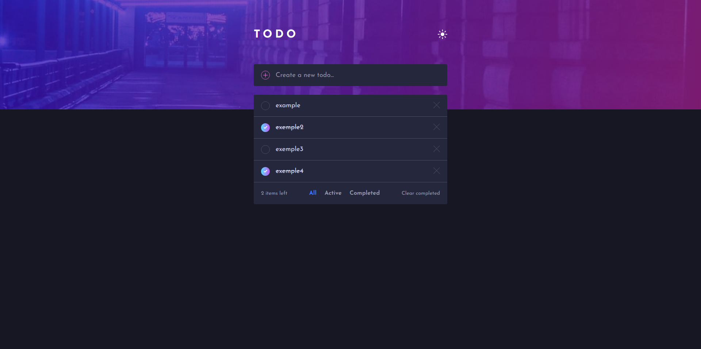

# Frontend Mentor - Todo app solution

Essa é uma solução para [Todo app challenge on Frontend Mentor](https://www.frontendmentor.io/challenges/todo-app-Su1_KokOW).

### 💻 O desafio

Os usuários devem ser capazes de:

- Adicionar novas tarefas a lista
- Marcar tarefas como completas
- Apagar tarefas da lista
- Filtrar tarefas por todas/ativas/completas
- Limpar todas tarefas completas
- Alternar entre tema claro/escuro
- Drag and drop para reordenar itens na lista

As tarefas adicionas pelo usuário ficam salvas no localStorage.

### Screenshot

### Links

- Solution URL: [https://github.com/gbmouraa/to_do](https://github.com/gbmouraa/to_do)
- Live Site URL: [https://gmoura-todo.netlify.app/](https://gmoura-todo.netlify.app/)

### 🔨 Projeto constrúido com

- HTML
- Sass
- Javascript
- ReactJS
- Framer motion

### 🙋‍♂️ Autor

- Portfólio - [Gabriel Moura](https://gmouradev.netlify.app/)
- Frontend Mentor - [@gbmouraa](https://www.frontendmentor.io/profile/gbmouraa)
- Linkedin - [Gabriel Moura](https://www.linkedin.com/in/gabriel-moura-b63382161/)
